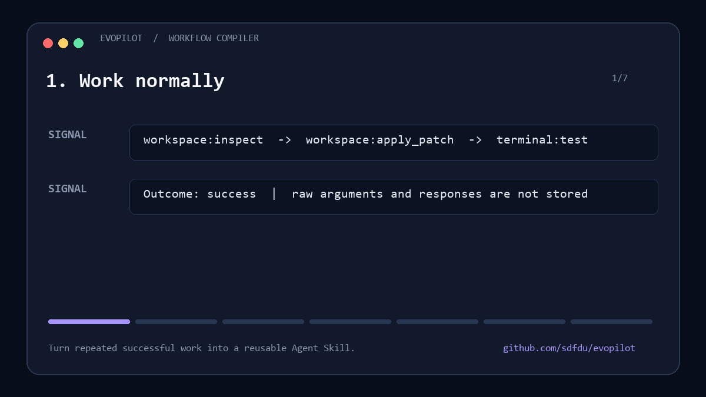

<div align="center">

# EvoPilot

### A Codex copilot that gets better at *your* work.

Local-first memory · app-specific habits · evidence-based coaching · self-growing Skills · MCP with human approval

</div>



EvoPilot observes privacy-minimized workflow signals, learns only from repeated evidence, and turns successful patterns into reusable Codex extensions. It can act autonomously on local, recoverable work while requiring a person before dangerous or externally consequential actions.

> **The goal is not unrestricted self-modification.** EvoPilot evolves through versioned workflows, tests, promotion thresholds, and rollback.

## Why EvoPilot?

Most assistants start from zero every time. Static prompts remember rules but do not measure whether a workflow actually helped. EvoPilot adds a practical learning loop:

```text
observe → detect a pattern → trial a workflow → measure outcomes
        → promote to Skill → draft MCP if needed → ask before new permissions
```

## What ships today

- **Local adaptive memory** backed by SQLite; no cloud account or API key required.
- **Privacy-minimized hooks** that record tool categories, outcomes, and a one-way workspace hash, never raw paths or tool input/output.
- **Dynamic habit detection** with evidence and success thresholds.
- **Human-in-the-loop policy** for publication, deletion, credentials, purchases, system settings, and MCP enablement.
- **Dependency-free MCP server** exposing memory, observation, habit analysis, export, deletion, and action review tools.
- Six focused Skills:
  - `idea-lab` — discuss and decide before building.
  - `dev-flow` — adapt coding and verification to proven habits.
  - `tool-operator` — route tools quickly while preserving approval boundaries.
  - `knowledge-coach` — evidence-based encouragement and friction analysis.
  - `automation-watcher` — low-noise reminders and recurring checks.
  - `extension-foundry` — promote proven workflows into Skills and MCP drafts.

## Quick start

Requirements: Codex desktop or CLI, Git, and Python 3.10+.

```bash
git clone https://github.com/sdfdu/evopilot.git
cd evopilot
codex plugin marketplace add .
```

Then install **EvoPilot** from the Codex plugin interface and start a new task. MCP enablement remains under your Codex approval configuration.

### Verify memory tools

After installing or upgrading, fully restart Codex and start a new task. Ask:

```text
Use EvoPilot to remember that I prefer concise answers.
```

Then start another task and ask EvoPilot to show its learned context. If the task reports that memory is unavailable or the `evopilot-memory` server shows zero tools, update to v0.1.2 or later and restart Codex. EvoPilot v0.1.2 negotiates the MCP protocol version requested by current Codex releases and enables UTF-8 explicitly for Windows paths.

For diagnosis, run the bundled server directly and send it `initialize` followed by `tools/list`. Errors are written to stderr, while stdout remains valid newline-delimited JSON-RPC. Do not edit files inside the Codex plugin cache; reinstall or update the plugin instead.

If you prefer GitHub shorthand, add the marketplace directly with `codex plugin marketplace add sdfdu/evopilot`.

On the first new task, review and trust the bundled hooks when Codex asks. Then use the initialization prompt once:

```text
Initialize EvoPilot with my preferences: discuss before building, recommend a default, act autonomously on local recoverable work, and ask immediately before dangerous or external actions.
```

Try:

```text
Use EvoPilot to help me develop this idea. Give me choices and wait until I say generate.
```

```text
Show what EvoPilot has learned about how I use my development tools.
```

```text
Analyze my repeated friction and propose the next safe extension.
```

## Safety model

| Action | Default |
|---|---|
| Read/search/analyze | Autonomous |
| Edit authorized workspace | Autonomous |
| Run tests/builds | Autonomous |
| Draft a Skill or MCP | Autonomous |
| Delete material data | Human required |
| Send, publish, purchase, or make public | Human required |
| Use credentials or change system settings | Human required |
| Enable a new MCP or expand access | Human required |
| Unknown action | Fail closed; human required |

Language-model instructions are not the only control. Keep Codex sandboxing, approvals, filesystem boundaries, and network policy enabled for independent enforcement.

## Learning without becoming creepy

EvoPilot stores structured, inspectable records locally. It rejects obvious secrets, redacts sensitive metadata, and deliberately avoids saving raw tool arguments and responses.

A preference carries:

- confidence;
- evidence count;
- scope;
- risk classification;
- timestamps.

One correction is evidence. Repeated successful behavior becomes a candidate workflow. Permissions never become implicit through repetition.

## Architecture

```text
Codex
├── Skills ───────────── workflow guidance and routing
├── Hooks ────────────── privacy-minimized observations + session context
├── EvoPilot MCP ─────── inspectable memory and policy tools
└── Local data
    ├── memories
    ├── observations
    ├── workflow candidates
    └── approval audit
```

No third-party Python packages are required.

## Local development

```bash
python -m unittest discover -s tests -v
python plugins/evopilot/scripts/evopilot.py observe vscode run-tests --outcome success
python plugins/evopilot/scripts/evopilot.py habits
python plugins/evopilot/scripts/evopilot.py context
```

See [CONTRIBUTING.md](CONTRIBUTING.md) for extension guidelines and [ROADMAP.md](ROADMAP.md) for planned work.

Ready-to-use launch copy is available in [LAUNCH.md](LAUNCH.md).

## Current limits

- Habit analysis in v0.1 uses transparent frequency and outcome rules, not semantic sequence mining.
- Hooks see Codex tool events, not every gesture performed inside arbitrary desktop applications.
- Generated MCP servers are drafts until a user reviews permissions and explicitly enables them.
- EvoPilot does not train or modify model weights.

## License

MIT — see [LICENSE](LICENSE).
